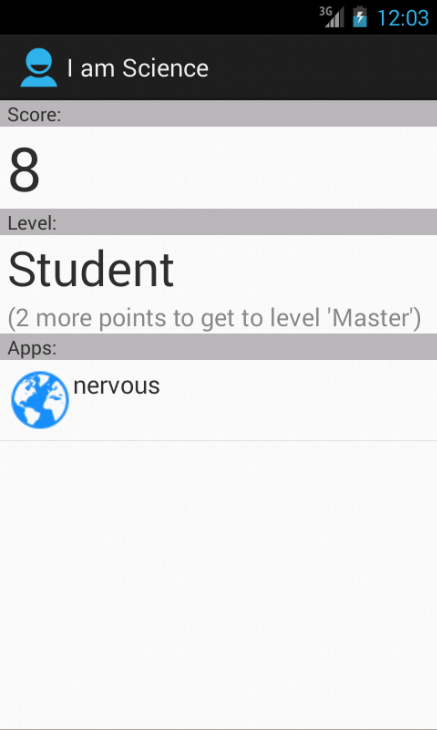

I am Science
============

Central app for science apps.

Features:

- List of science apps (click to run/install)
- Scores for activities within I am Science apps
- "Career" levels: Master, Professor, Nobel Prizes

Todo:

- Highscores
- Push notifications
- Secure update of scores
- Light-weight apps (e.g. just URL to survey)

Screenshot
----------

This is a screenshot of the current app (very preliminary and work in
progress):

License
-------

I am Science is open source software under the terms of the GNU General Public
License. See LICENSE.txt and http://www.gnu.org/licenses/gpl.html for the
details.
