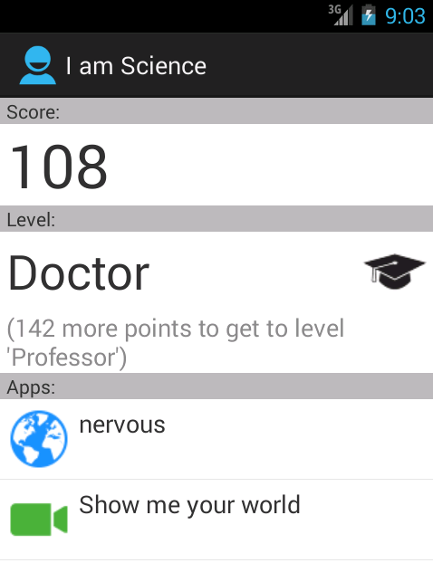

I am Science
============

Central app for science apps.

Planned features, short term:

- List of science apps (click to install)
- Scores for activities within I am Science apps
- "Career" levels: Master, Professor, Nobel Prizes

Longer term:

- Access to (aggregated) data for users at a certain level
- Users can publish small results on data
- Reputation
- Impact

Screenshot
----------

This is a screenshot of the current app (very preliminary and work in
progress):

License
-------

I am Science is open source software under the terms of the GNU General Public
License. See LICENSE.txt and http://www.gnu.org/licenses/gpl.html for the
details.
